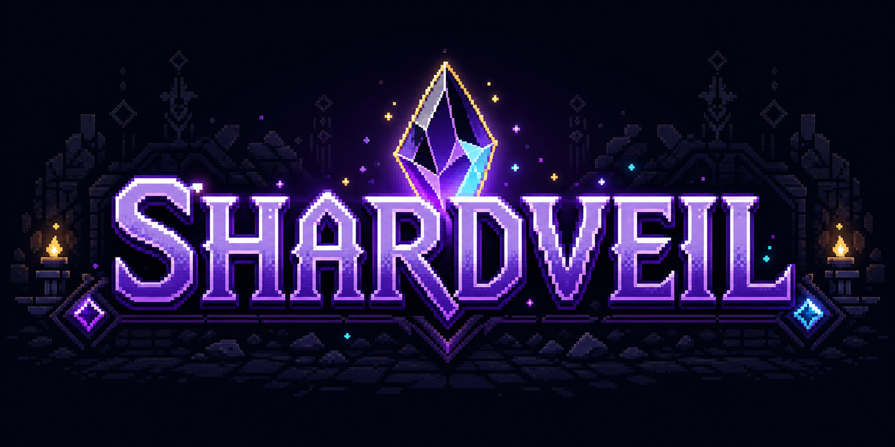

<p align="center">
  
</p>

<p align="center">
  Пошаговый roguelike dungeon crawler на Python и Arcade
</p>

<p align="center">
  <a href="https://github.com/skulhex/shardveil/releases"></a>
  <a href="https://github.com/skulhex/shardveil/actions/workflows/test.yml"></a>
  <a href="LICENSE"></a>
</p>

<p align="center">
  <a href="https://www.python.org/"></a>
  <a href="https://api.arcade.academy/"></a>
  <a href="https://nuitka.net/"></a>
</p>

## О проекте

Игрок исследует процедурно генерируемые уровни подземелья, сражается с врагами, собирает предметы и спускается глубже.

Одна из основных механик — запас света. Он расходуется при действиях игрока, влияет на освещение уровня и восстанавливается при пропуске хода. После действия игрока ход получают враги.

Проект находится в **alpha-версии**. Актуальные версии доступны в разделе [GitHub Releases](https://github.com/skulhex/shardveil/releases).

## Возможности

- Пошаговое перемещение и контактный бой на тайловой карте
- Процедурная генерация подземелий с помощью BSP
- Переход между глубинами подземелья через лестницы
- Враги Skeleton с логикой преследования игрока
- Ресурс света, влияющий на освещение уровня и HUD
- Инвентарь с экипировкой и хранилищем предметов
- Предметы на карте, ручной подбор добычи и сундуки
- Главное меню, пауза, экран инвентаря и экран конца игры

## Готовые сборки

В разделе [GitHub Releases](https://github.com/skulhex/shardveil/releases) опубликованы архивы standalone-сборок игры:

- Windows x64: `Shardveil-windows-x64.zip`
- Linux x64: `Shardveil-linux-x64.tar.gz`

После распаковки архива игру можно запустить без установки: executable находится в папке `Shardveil/` вместе с необходимыми файлами.

macOS-сборку можно создать локально через Nuitka. Инструкции для всех платформ приведены в [документации по сборке](docs/build_nuitka.md).

## Управление

| Клавиши | Действие |
| --- | --- |
| `WASD` или стрелки | Перемещение |
| `Space` | Пропустить ход и восстановить свет |
| `C` | Подобрать предмет с текущей клетки |
| `I` | Открыть или закрыть инвентарь |
| `Esc` | Пауза или возврат назад |
| `+` / `-` | Изменить масштаб камеры |

## Установка и запуск из исходников

Для запуска рекомендуется Python 3.12 и локальное виртуальное окружение `.venv`.

Склонируйте репозиторий:

```bash
git clone https://github.com/skulhex/shardveil.git
cd shardveil
```

Создайте и активируйте виртуальное окружение:

```bash
python3 -m venv .venv
source .venv/bin/activate
```

Для Windows (PowerShell):

```powershell
python -m venv .venv
.venv\Scripts\Activate.ps1
```

Установите зависимости:

```bash
python -m pip install --upgrade pip
python -m pip install -r requirements.txt
```

Запустите игру:

```bash
python src/main.py
```

## Тесты

```bash
python -m pytest
```

## Документация

- [Game Design Document](docs/GDD.md)
- [Standalone-сборка через Nuitka](docs/build_nuitka.md)

## Структура проекта

```text
shardveil/
├── assets/             # графические ресурсы
├── docs/               # документация проекта
├── packaging/          # иконки standalone-приложения
├── scripts/            # скрипты сборки через Nuitka
├── src/
│   ├── main.py         # точка входа
│   └── sv/
│       ├── game.py     # окно Arcade и связка игровых систем
│       ├── ai/         # логика решений врагов
│       ├── core/       # состояние игры, ввод, коллизии и рендеринг
│       ├── entities/   # игровые сущности
│       ├── items/      # предметы и инвентарь
│       ├── ui/         # HUD, меню и оверлеи
│       └── world/      # генерация уровней и сборка сцены
└── tests/              # автоматические тесты
```

## План развития

- Добавить второй тип врага
- Добавить применение расходуемых предметов
- Добавить экран победы или цель забега
- Улучшить ИИ врагов
- Расширить механику света
- Добавить звуковое оформление и музыку
- Добавить минимальный сюжет

## Лицензия

Проект распространяется по лицензии [MIT](LICENSE).
